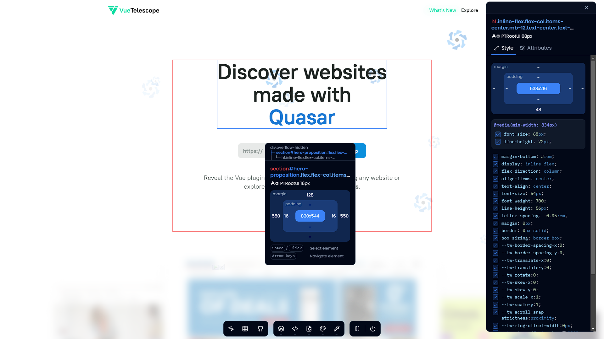

# Inspect CSS
The easiest way to inspect and edit CSS

## Features
- 🔎 Get CSS Properties from any element by selecting it
- ✏️ Get and edit element attributes
- 📷 Download website assets
- ⌨️ Add your custom CSS to the website
- 🎨 Get the color palette of the website
- 🧭 DOM Navigation
- 🎯 Color picker (Chromium only)

## Installation
- `yarn install` to install all dependencies 
- `yarn watch:dev` for development 
- `yarn build` build for production
